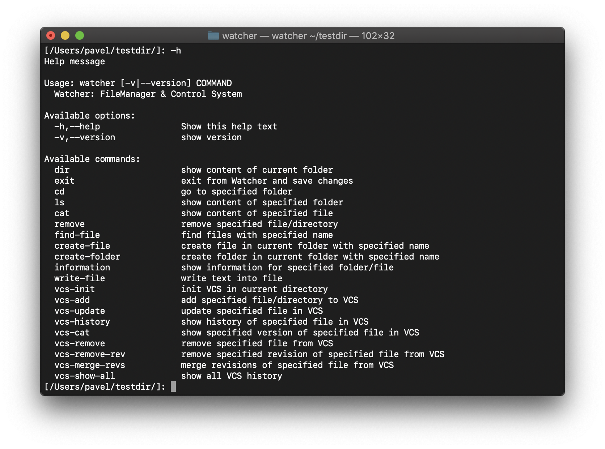

# 📁💻 Watcher: File Manager & Version Control System
[](https://github.com/fp-ctd-itmo/hw2-pavponn/blob/master/LICENSE)


Watcher is a file manager with built-in support of version control system implemented in Haskell.

## Summary 
- Watcher is a Unix compatible file manager.
- Initial directory treated as a root by this file manager. It means that it's only possible to work with initial directory and its subdirectories.
- You can use both _relative_ and _absolute_ paths. However, _absolute_ path starts at your initial folder. Here is an example:
initial directory: `/Users/user/a/`, then absolute path is `/b/c/d`, not `/Users/user/a/b/c/d`.
- It's possible to init VCS in every folder of the system, however you can initialize VCS in each folder only once (similarly to git). `Current VCS` is the closest VCS to your current directory.
- Build in VCS is able to track file/folder addition & file/folder edition.

## Quickstart
You'll need [Stack](https://docs.haskellstack.org/), [GHC](https://www.haskell.org/ghc/) and [Git](https://git-scm.com/downloads).

💾 Clone/fork repo:

```bash
git clone https://github.com/pavponn/watcher.git
```

⚙️ Build library / compile sources:
```bash
stack build
```

🚀 Run watcher:
```bash
stack run <initial directory>
```

🔬Test:
```bash
stack test
```

 

## Tests
Tested manually on macOS Catalina 10.15.4.

Autotests were written using Hspec.

## Copyright
Pavel Ponomarev, 2020

MIT License.
